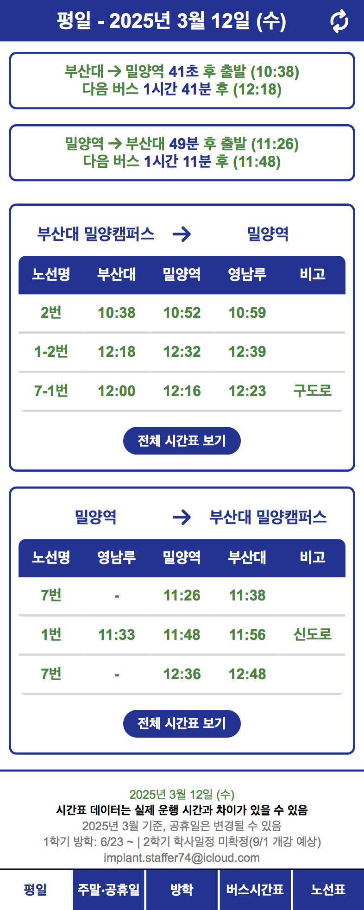
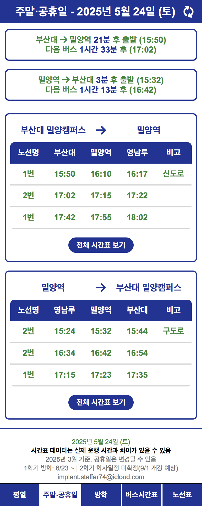
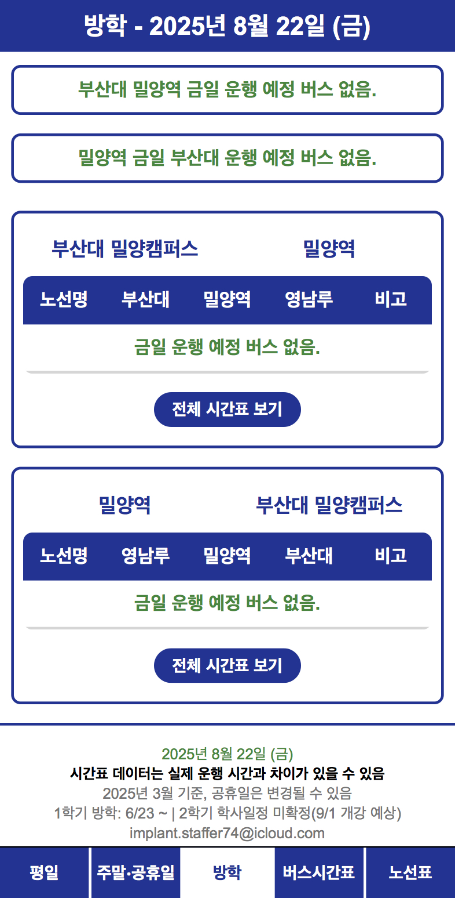

# 시내버스 시간표 뷰어

## 주요 기능

- **버스 시간표 제공**: 필요에 따라 현재시간 기준 시간표 보기와 전체 보기를 제공
- **실시간 필터링**: 현재 시간 이후의 운행 예정 버스만 필터링하여 표시

  
  
  

## 버전 정보

### v1.4.0 (최신 버전)

- 주말/공휴일, 방학 시간표 연동
- 날짜 연동

### v1.3.0

- 시간 정렬 버그 수정
- 버스 노선 "번" 추가
- 제일 빠른 버스 표시
- 헤더 UI 수정
- 네비게이션바 UI 수정

### v1.2.0

- 새로고침 버튼 추가
- 자동 리프레시 기능 추가

### v1.1.0

- 전체 시간표 보기/접기 기능 개선
- 시청 시간표 연결 버튼 활성화

### v1.0.0

- 기본 UI 구성 완료
- 양방향 버스 시간표 구현
- 시간표 간략/전체 보기 기능 추가
- 실시간 버스 정보 표시 기능 구현
